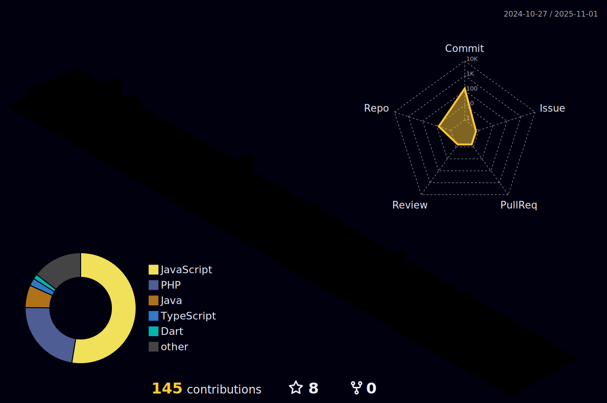

|  |  |
| ----------- | ----------- |

## 🛠 Tech Stack

  

---

## 🌎 Connect with Me

  
  
  

Acesse meu portfólio em: 
<a href="https://gitfollio.vercel.app/joaobatista235"> 🔗
  https://gitfollio.vercel.app/joaobatista235
</a>

<!-- GitFolio:start
{
  "gitfolio": "on",
  "name": "João Batista",
  "email": "juniorbatista0404@gmail.com",
  "tagline": "Full Stack Developer",
  "avatar_url": "https://avatars.githubusercontent.com/u/62124351?v=4",
  "website": "",
  "githubUser": "joaobatista235",
  "linkedinUser": "https://www.linkedin.com/in/devjoaobatista",
  "about": "Hi! I'm João, a passionate Full Stack Developer dedicated to building innovative, scalable, and user-centered web and mobile solutions. My goal is to keep evolving as a developer and contribute to innovative projects that make a real difference.",
  "showStars": false,
  "showFollowers": true,
  "followers": 23,
  "following": 13,
  "themeId": "dark",
  "tech": [
    "PHP",
    "Javascript",
    "ReactJs",
    "NodeJs",
    "MySQL"
  ],
  "projects": [
    {
      "id": 976364850,
      "repoName": "know-your-fan",
      "url": "https://github.com/joaobatista235/know-your-fan",
      "stars": 1,
      "description": "Know Your Fan é uma plataforma completa para gerenciamento de comunidades de fãs.",
      "image": "https://github.githubassets.com/images/modules/logos_page/GitHub-Mark.png",
      "techs": ["Python/Flask", "ReactJs", "Chakra UI", "Firebase"],
      "deploy": "",
      "highlighted": false
    },
    {
      "id": 976253024,
      "repoName": "furia-chat-experience",
      "url": "https://github.com/joaobatista235/furia-chat-experience",
      "stars": 1,
      "description": "Um chat interativo para fãs da FURIA CS2, oferecendo informações em tempo real sobre partidas e estatísticas.",
      "image": "https://github.githubassets.com/images/modules/logos_page/GitHub-Mark.png",
      "techs": ["ReactJs", "OpenAI API", "Stitches", "Vite"],
      "deploy": "",
      "highlighted": false
    },
    {
      "id": 900116999,
      "repoName": "electrify",
      "url": "https://github.com/joaobatista235/electrify",
      "stars": 1,
      "description": "Electrify é um aplicativo mobile em React Native que permite monitorar e analisar o consumo de energia elétrica.",
      "image": "https://github.githubassets.com/images/modules/logos_page/GitHub-Mark.png",
      "techs": ["React Native", "Expo", "Firebase"],
      "deploy": "",
      "highlighted": false
    },
    {
      "id": 788581983,
      "repoName": "srincrivel",
      "url": "https://github.com/joaobatista235/srincrivel",
      "stars": 1,
      "description": "Um bot de Discord em Node.js com funcionalidades como música, integração com IA e muito mais.",
      "image": "https://github.githubassets.com/images/modules/logos_page/GitHub-Mark.png",
      "techs": ["NodeJs", "DiscordJs", "FFMPEG", "Gemini API"],
      "deploy": "",
      "highlighted": true
    }
  ]
}
GitFolio:end -->

